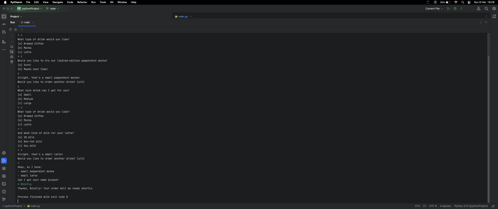

# Coffee Chat Bot 

Whether it’s to get us ready to jump-start our day or to get us through a late-night cram session, many of us need our regular caffeine fix! Ordering coffee is just one example of a process that can be automated with the help of a chatbot.

The task was to create a Python chatbot that can help cut the wait time of a normal coffee run by taking customers’ orders in advance

## Lessons

- 
- 

## Demonstration

